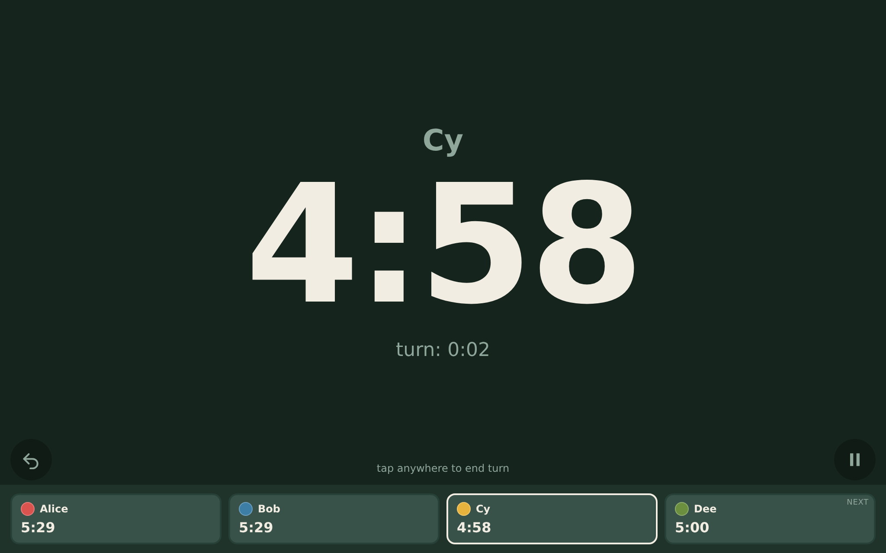
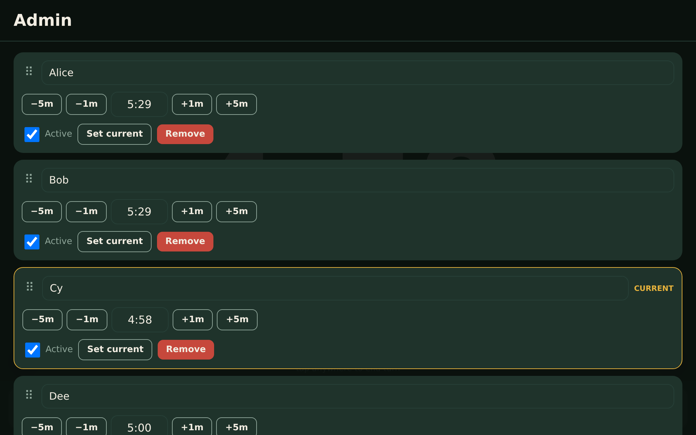
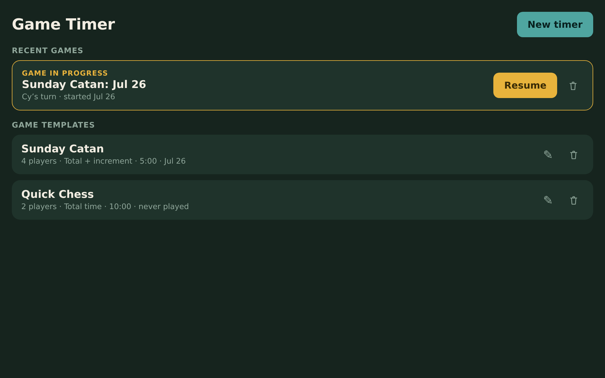

# Game Timer

A chess-clock-style turn timer for tabletop games. Static site, no backend,
no build step — plain HTML/CSS/JS, meant to run full-screen on a shared
tablet (or phone) in the middle of the table.

Live at: https://turtlemonvh.github.io/game-timer/

## Install it

The site is an installable Progressive Web App — on iOS (Safari) use
**Share → Add to Home Screen**, on Android (Chrome) use **⋮ → Install app** /
**Add to Home screen**. Installed, it launches full-screen with its own icon,
no browser chrome, and works offline (it's cached by a service worker, and
all game data lives in `localStorage` on the device). The installed app
follows the device's rotation — it's not locked to landscape or portrait.

## Screenshots

| Play | Admin | Home |
| --- | --- | --- |
|  |  |  |

## Modes

- **Total time** — each player gets one budget for the whole game; their
  clock runs only on their turn.
- **Per turn** — everyone gets the same fresh allowance every turn.
- **Total + increment** — like total time, but players gain time back at the
  end of each turn (Fischer-style). The increment can be set per player, not
  just once for the whole game.

Running out doesn't stop anything — the clock keeps counting into negative
time and the display flips to a red overdraft state. This is for family
play: the point is gentle visibility, not elimination.

## Using it

**Home screen**

- **Game templates** are reusable setups (players, colors, budgets, mode) —
  tap one to start a game from it. They stick around no matter how many
  times you've played them.
- **Recent games** shows the current in-progress game (if any) plus your
  recently finished games. Tap a finished game to revisit its summary.
  Delete either one with the trash icon, behind a confirmation.
- Starting a game while another is already in progress warns you first,
  since starting replaces the in-progress one.
- Each game gets a name when you start it, defaulting to
  `<template name>: <date>` — edit it if you want something more specific.

**Play screen**

- **Tap anywhere** to end the current turn.
- Tap another player in the strip at the bottom to **jump to them** out of
  turn order (for interrupts, trades, robbers, etc.).
- The small buttons in the bottom corners are **pause** and **undo**.

**Pause / Admin**

- Pausing opens a menu with **Resume**, **Admin**, **End game**, and
  **Leave game** (leaves it paused and resumable later from Home).
- **Admin** is only reachable from the pause menu, so the game is always
  visibly paused while you're editing it. From there: add/remove/rename
  players, adjust or set anyone's time directly, reorder, deactivate a
  player without removing them, toggle sound alerts, save changes back to
  the template, or end the game.

## Running it locally

No build step needed — just open `index.html` directly in a browser, or
serve the folder with any static file server:

```
python3 -m http.server 8000
```

## Tests

A regression suite lives in `tests/` — engine unit tests plus a Puppeteer
browser suite. See `tests/README.md`. Quick start:

```
cd tests && npm install && npm test
```

## Files

```
index.html             all screens, toggled by CSS class
styles.css             design tokens + all styling
app.js                 state, timing engine, persistence, rendering
manifest.webmanifest   installable PWA manifest
sw.js                  cache-first service worker for offline use
icons/                 app icons (192 + 512)
screenshots/           readme screenshots
tests/                 engine unit tests + Puppeteer browser regression suite
```

The timing engine (`app.js`, marked `ENGINE:START`/`ENGINE:END`) is pure —
it never decrements a running counter on a tick. Every displayed value is
computed fresh from an absolute timestamp, so the app survives tab
throttling, tablet sleep, and page reloads mid-turn without losing time.

## Data

Everything lives in `localStorage` on the device — there's no server, no
sync, no accounts. Four keys: `gt:profiles` (templates), `gt:activeGame`
(the in-progress game, if any), `gt:history` (recently finished games), and
`gt:lastProfileId`.

## Deploying

Pushed to `main`, served by GitHub Pages from the repo root.
